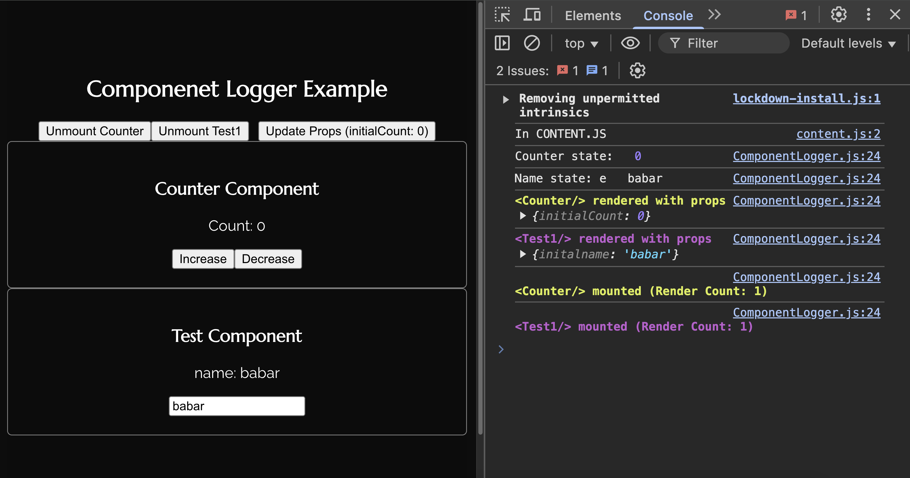
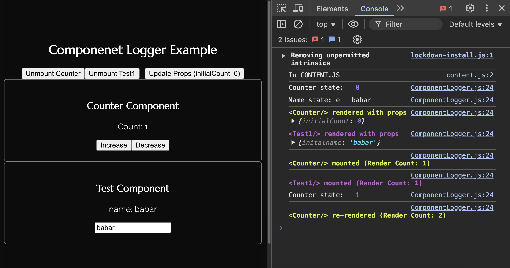
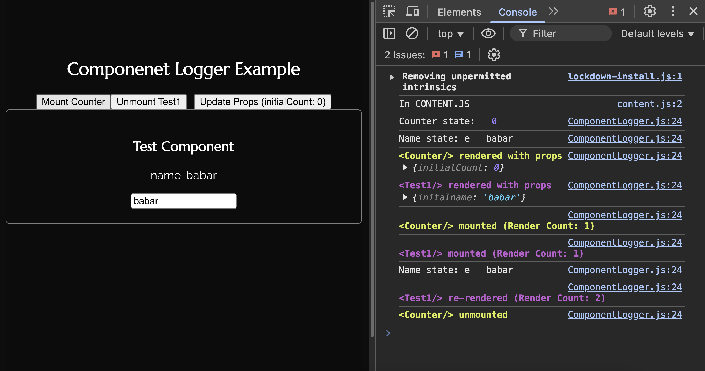
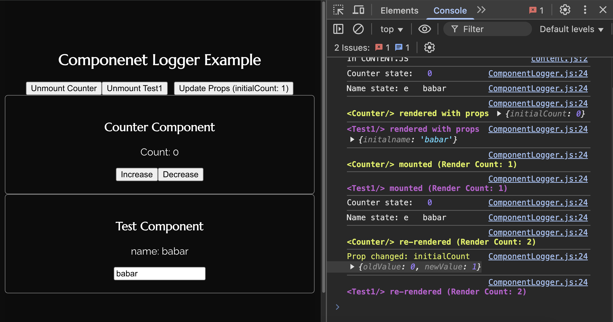

# React Component Logger

`react-component-logger` is a React debugging utility that helps track component renders, props changes, and mounting/unmounting lifecycle events in a visually distinct way. Each component gets a unique color for better readability in the console.

## Installation

```sh
npm install react-component-logger
```

or

```sh
yarn add react-component-logger
```

## Usage

### Basic Usage

Wrap your functional components with `comLog()` to log render counts, prop changes, and lifecycle events.

```jsx
import React, { useState } from 'react';
import comLog from 'react-component-logger';

function Counter({ count }) {
  comLog(); // Enable logging for this component
  return <div>Count: {count}</div>;
}

export default function App() {
  const [count, setCount] = useState(0);

  return (
    <div>
      <Counter count={count} />
      <button onClick={() => setCount(count + 1)}>Increment</button>
    </div>
  );
}
```

### Advanced Usage

You can also log specific variables or values:

```jsx
import React, { useState } from 'react';
import comLog from 'react-component-logger';

function ExampleComponent({ name }) {
  const log = comLog();
  const age = 25;
  log`User name: ${name}, Age: ${age}`;
  return <p>Hello, {name}!</p>;
}
```






### Features

- **Automatic Render Tracking:** Logs each render count for components.
- **Prop Change Detection:** Detects changes in props and logs old vs new values.
- **Component Mounting & Unmounting Logs:** Displays when a component is mounted and unmounted.
- **Unique Color Coding:** Each component gets a unique color in console logs.

## License

This project is licensed under the MIT License.

